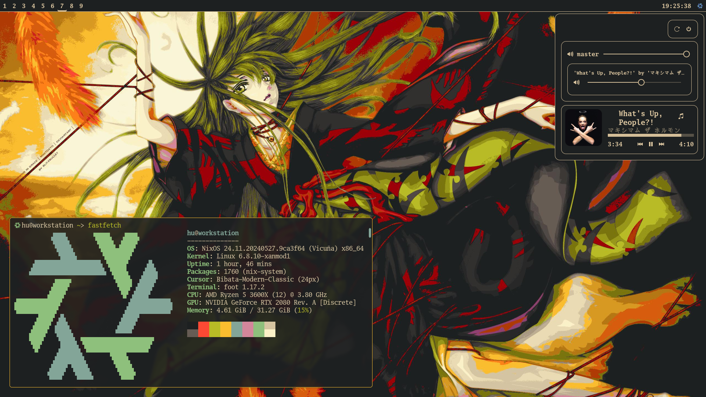

# nixos-system-config
My NixOS configuration.

## About
This is the NixOS configuration that I daily drive on my system. Feel free to use,
modify and share this configuration to your heart's content, no attribution required.

## Screenshots
[Wallpaper](https://yande.re/post/show/30591).



## Layout
```
├── assets                              ; Images used by the config and repo
│   └── wallpaper.png
├── flake.lock
├── flake.nix                           ; Entry point
├── machines                            ; Machine specific configuration
│   └── workstation
│       ├── configuration.nix
│       ├── hardware-configuration.nix  ; Modified hardware configuration
│       └── persist.nix                 ; Impermanence configuration
├── packages                            ; Sets of packages to install and configure
│   ├── sets
│   │   ├── games.nix
│   │   └── ...
│   └── wm                              ; Package sets and basic config for WM and DE
│       ├── hyprland.nix
│       └── ...
├── README.md
├── secrets                             ; Git ignored folder to store confidentials
│   └── hu
│       └── pass                        ; Hashed password file for user
└── users
    └── hu                              ; User specific configuration
        ├── packages                    ; Package configurations
        │   ├── firefox.nix             ; Configurations can be for NixOS or home-manager
        │   ├── ...
        │   └── zsh
        │       ├── config              ; Non-nix package config directory
        │       │   └── conf.d
        │       ├── zsh-home.nix        ; For home-manager
        │       └── zsh.nix             ; For NixOS
        ├── persist.nix                 ; Impermanence configuration for the user
        └── user.nix
```

## Installing
This configuration uses impermanence with btrfs snapshots so you'll have to partition
your system in a certain way.

First you'll need this partition layout, assuming you're installing on `nvme0n1`.
```
DEVICE              FILESYSTEM      PURPOSE
/dev/nvme0n1
├─/dev/nvme0n1p1    vfat            EFI partition
└─/dev/nvme0n1p2    btrfs           Partition to house all the subvolumes
```

Inside of the btrfs root volume we're going to need 2 subvolumes.
```
SUBVOLUME           MOUNT           PURPOSE
root                /               Impermanent data
nix                 /nix            Permanent data
```

You'll also need to create a read-only snapshot of the `root` subvolume
and call it `root-blank`.

After you've mounted all the subvolumes and EFI partition (`/boot`) in `/mnt`
clone this repository in to `/mnt/nix/config`. Adjust all the block ids of the partitions
in `hardware-configuration.nix` and create a hashed password using `mkpasswd` and store it
in the `secrets/{user}` directory as `pass`.  

Finally, in the config directory run `nixos-install --flake '.#'`, reboot and you're done.

